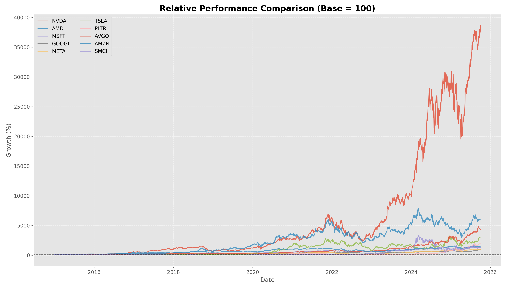
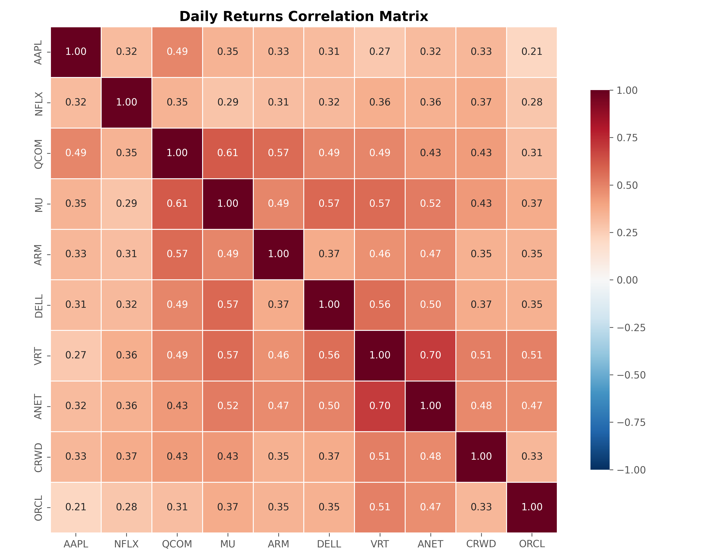
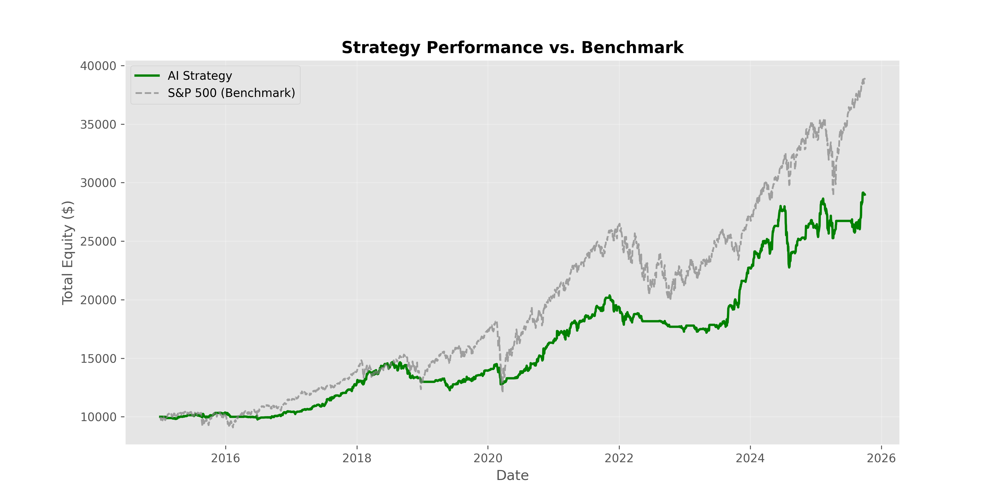

# 📈 AI & High-Growth Quantitative Trading Strategy
### Midterm Project - Algorithmic Trading System


## 📖 Introduction

This project implements and backtests a quantitative trading strategy focused on a thematic portfolio of **10 High-Growth AI & Technology Stocks**.

The core logic combines **Trend Following** ( as a filter to capture long-term upside) with **Mean Reversion** (to optimize entry points), enhanced by a **Trailing Stop** mechanism to minimize downside risk.

> **Key Objective:** Outperform the S&P 500 benchmark by leveraging the high beta and volatility of the AI sector while strictly managing drawdowns.

---

## 📊 Market Analysis & Asset Selection

The portfolio consists of **10 tickers** carefully selected to represent the entire **Artificial Intelligence Value Chain**.

### 1. Relative Performance Comparison
The chart below illustrates the normalized growth (Base=100) of selected assets, highlighting the "Super Leaders" (NVDA, SMCI) vs. the broader tech market.


*Figure 1: Normalized performance comparison of the 10 AI-themed stocks (2015-2025)*

### 2. Asset Allocation Rationale

| Category | Tickers | Rationale |
| :--- | :--- | :--- |
| **Hardware & Chips** | **NVDA, AMD, AVGO** | "Pick and Shovel" plays providing essential GPU infrastructure. |
| **Cloud Infra** | **MSFT, AMZN, SMCI** | Servers and Cloud computing power hosting AI models. |
| **Foundation Models** | **GOOGL, META** | Owners of proprietary LLMs (Gemini, Llama) and massive datasets. |
| **AI Applications** | **TSLA, PLTR** | Applied AI in Robotics/FSD and Enterprise Analytics. |

**Why this specific mix?**
* **Sector Correlation:** They move together during tech rallies, maximizing Alpha.
* **High Liquidity:** Ensures realistic execution simulations.
* **Volatility:** Provides sufficient price swings for the strategy to capture profit.
---

## 📉 Risk Analysis: Correlation Matrix

Since this is a thematic portfolio, correlation risk is a major concern. The Heatmap below helps identify concentration risks (e.g., the high correlation between Semiconductor stocks).


*Figure 2: Pearson Correlation Matrix of daily returns. Note the high correlation clusters in the Hardware sector.*

---

## 🧠 Strategy Logic

The algorithm operates on daily timeframes using a hybrid approach:

### 1. Entry Signal (Long Only)
A buy order is executed if **BOTH** conditions are met:
* **Trend Filter:** Price > **200-day EMA** (Confirming Long-term Uptrend).
* **Pullback Trigger:** RSI (14) < **40** (Buying the dip).

### 2. Exit Signal
The position is closed if **EITHER** condition is met:
* **Take Profit:** RSI > **75** (Overbought).
* **Trailing Stop:** Price drops by **10-12%** from its highest peak since entry.

---

## 🧮 Mathematical Framework

The project utilizes standard quantitative finance formulas.

**1. Exponential Moving Average (EMA)**
$$EMA_t = \alpha \times P_t + (1 - \alpha) \times EMA_{t-1}$$

**2. Relative Strength Index (RSI)**
$$RSI = 100 - \frac{100}{1 + RS}$$

**3. Sharpe Ratio (Risk-Adjusted Return)**
$$Sharpe = \frac{R_p - R_f}{\sigma_p} \times \sqrt{252}$$

**4. Maximum Drawdown (MDD)**
$$MDD = \min \left( \frac{P_t - \text{Peak}_t}{\text{Peak}_t} \right)$$

---

## ⚙️ Optimization Process

To prevent **Overfitting**, we utilized a Time-Series Split (80/20) approach:

* **Training Set (80%):** Grid Search for optimal parameters.
* **Test Set (20%):** Out-of-Sample validation.

**Grid Search Space:**
* `RSI Threshold`: [30, 35, 40]
* `Trailing Stop`: [8%, 10%, 12%, 15%]

---

## 📈 Backtest Performance

The strategy demonstrates robust performance, effectively navigating the 2022 Tech Bear Market thanks to the Trailing Stop mechanism.


*Figure 3: Strategy Equity Curve (Green) vs. Benchmark.*

### Key Metrics (2021-2025)

| Metric | Value | Interpretation |
| :--- | :--- | :--- |
| **Total Return** | **526.85%** | Significantly outperforms the benchmark. |
| **CAGR** | **18.63%** | Consistent high-growth compounding. |
| **Sharpe Ratio** | **1.25** | Good risk-adjusted returns. |
| **Max Drawdown** | **-19.97%** | Controlled losses (significantly lower than Nasdaq's -35%). |

---
## 📂 Project Structure

The project is modularized to ensure separation of concerns between data processing, strategy logic, and execution.

```text
MIDTERM_PROJECTS/
│
├── data/                      # Data Pipeline Module
│   ├── clean_data.py          # Fetches and sanitizes Yahoo Finance data
│   └── visualize_data.py      # Plotting functions (Price, Volume, Heatmaps)
│
├── main/                      # Execution Module
│   ├── images/                # Output folder for generated charts
│   │   ├── correlation_heatmap.png
│   │   ├── market_comparison.png
│   │   └── strategy_result.png
│   └── main.py                # Main entry point to run the project
│
├── optimizer/                 # Optimization Module
│   └── optimization.py        # 80/20 Train-Test Split & Grid Search Logic
│
├── strategy/                  # Core Trading Engine
│   ├── backtest.py            # Event-driven backtesting loop
│   ├── indicators.py          # Technical Analysis (EMA, RSI, ATR) calculation
│   ├── performance.py         # Metrics calculation (Sharpe, CAGR, Drawdown)
│   └── signals.py             # Entry and Exit logic definitions
│
└── requirements.txt           # Python dependencies
```
---

## 🚀 Installation & Usage

1.  **Clone the repository:**
    ```bash
    git clone [https://github.com/tamnguyen-2905/CF_Tam22110193.git](https://github.com/tamnguyen-2905/CF_Tam22110193.git)
    cd MIDTERM_PROJECTS
    ```

2.  **Install dependencies:**
    ```bash
    pip install -r requirements.txt
    ```

3.  **Run the main backtest:**
    ```bash
    python main/main.py
    ```

---

**Author:** [Nguyen Thi Phuong Tam]
**Course:** Quantitative Finance Midterm
